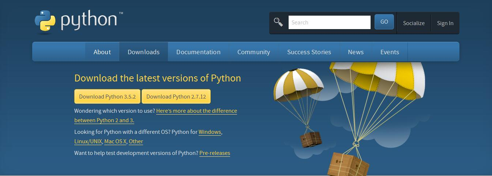
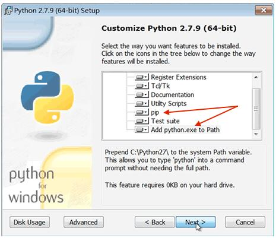
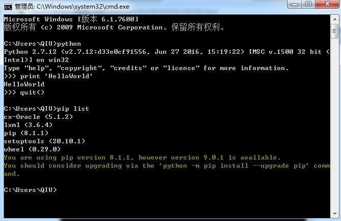

## Python安装 ##
### Python版本 ###
下载地址：[https://www.python.org/downloads/](https://www.python.org/downloads/)

### Python安装步骤 ###

pip 是一个安装和管理 Python 包的工具，python安装包的工具有easy_install, setuptools, pip，distribute

### Python IDE

