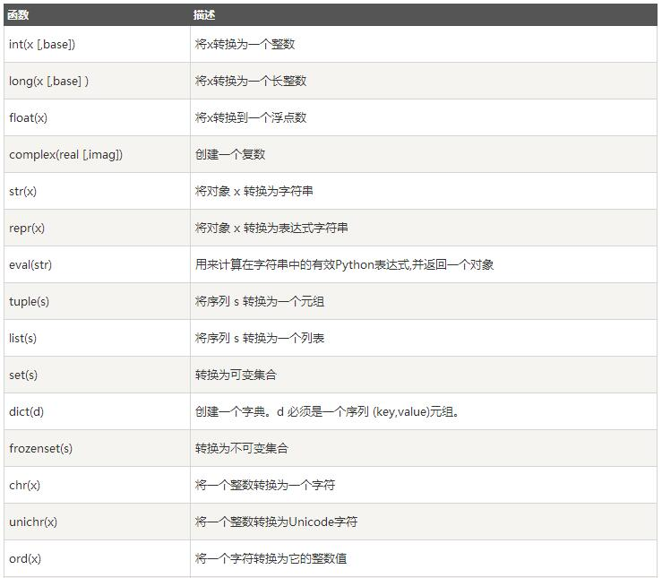
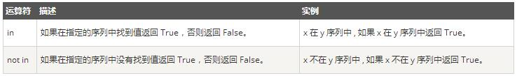
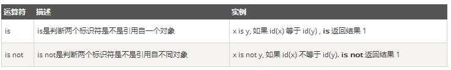
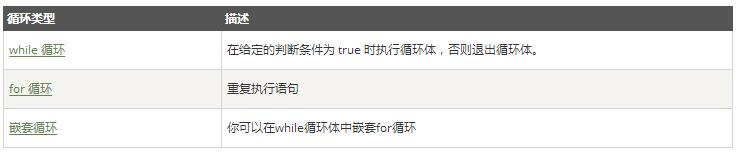
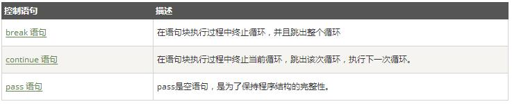

###	1. Python基础语法 ###
####（1）标识符 ####
- 所有标识符可以包括英文、数字以及下划线（_），但不能以数字开头。
- 区分大小写。
- 以下划线开头的标识符是有特殊意义的：
	-	已单下划线开头的(_foo)代表不能直接访问的类属性，需通过类提供的接口进行访问，不能用“from xxx import *”而导入；
	-	以双下划线开头的(\_\_foo)代表类的私有成员；
	-	以双下划线开头和结尾的代表特殊方法专用的标识，如\_\_init\_\_()代表类的构造函数。  

####（2）行和缩进 ####

- Python的代码块不用大括号来控制类、函数和其他逻辑判断，而是缩进。  
- Python语句中一般以新行作为为语句的结束符，但是可以使用斜杠\）将一行的语句分为多行显示。  

#### （3）引号 ####
- 用单引号、双引号、三引号表示字符串
- 引号的开始与结束必须使用相同类型
- 三引号可以由多行组成，在特定位置，三引号可用来做注释  

#### （4） 注释 ####
- 单行注释用#
- 多行注释用三引号'''或"""  

### 2. 数据类型 ###
- Numbers（数字）
- String（字符串）
- List（列表）
- Tuple（元组）
- Dictionary（字典）  

#### （1）Numbers 数字 ####
Python支持4种不同的数字类型：int、long、float、complex。  

	number1 = 1
	number2 = 2
	print number1+number2 #输出3  

#### （2）String 字符串 ####
Python中字符串由单引号、双引号、三引号表示  

	str1 = 'Hello'
	str2 = " "
	str3 = '''World'''
	str4 = """!"""
	print str1+str2+str3+str4 #输出Hello World!
Python中字符串有2种取值顺序：  

- 从左到右，索引从0开始
- 从右到左，索引从-1开始  

#
	str = 'Hello World!'
	print str[0] #输出H
	print str[0:3] #输出Hel
	print str[-1] #输出!
	print str[:-1] #输出Hello World  
	
#### （3）List 列表 ####
List是Python中使用最频繁的数据类型，用[]标识。  
取值顺序2种：从左到右、从右到左。   

	list1 = ['A','B','CDE',123,3.14,'Hello']
	list2 = ['World','!']
	print list1 #输出['A','B','CDE',123,3.14,'Hello']
	print list2 #输出['World','!']
	print list1[1] #输出B
	print list1[3:5] #输出[123,3.14]
	print list1+list2 #输出['A','B','CDE',123,3.14,'Hello','World','!']
	print list1[5:6]+list2 #输出['Hello','World','!']  

#### （4）Tuple	元组 ####
Tuple类似于List，用()标识，内部元素用逗号隔开。  
Tuple是只读列表，不可二次赋值。  
	
	tuple1 = ('A','B','CDE',123,3.14,'Hello')
	tuple2 = （'World','!')
	print tuple1 #输出('A','B','CDE',123,3.14,'Hello')
	print tuple1[0] #输出A
	print tuple1[3:5] #输出(123,3.14)
	print tuple1[5:6]+tuple2 #输出('Hello','World','!')

#### （5）Dictinoary 字典 ####
Dictionary是除List以外Python中最灵活的内置数据结构类型，是一个无序的对象集合，用{}标识，由key和value组成。 

	dict1 = {'one':1,'two':2,'three',3,'four','4','five':'5'}
	dict2 = {'seven':'7','eight':'8'}	
	print dict1 #{'one':1,'two':2,'three':3,'four':'4','five':'5'}
	dict1['one'] = '一'
	dict1['six'] = '6'
	print dict1 #输出{'one':'一','two':2,'three',3,'four','4','five':'5','six':'6'}    
	
	
### 3. 数据类型转换 ###
	print int('10') #输出10
	print str(10.3) #输出10.3
	print list('123') #输出['1','2','3']
	print list((123,'123','456')) #输出[123,'123','456']
	print dict(one=1,two=2,three='three') #输出{'one':1,'tow':2,'three':'three'}

  
### 4. 运算符 ###
算数运算符、比较运算符、赋值运算符、逻辑运算符、位运算符、**成员运算符**、**身份运算符**。
#### （1）成员运算符 ####
成员运算符用来测试实例中是否包含某成员，包括字符串、列表或元组。

	str1 = 'HelloWorld'
	str2 = 'Hello'
	str3 = 'HW'
	if(str2 in str1):
		print str2+' 存在于字符串 '+str1+' 中'
	else:
		print str2+' 不存在于字符串 '+str1+' 中'
#### （2）身份运算符 ####
身份运算符用于比较两个对象的存储单元。  

	a1 = 10
	a2 = 10
	print a1 is a2 #True
	str1 = 'Hello'
	str2 = 'Hello'
	print str1 is str2 #True
	list1 = [1,2,3]
	list2 = [1,2,3]
	print list1 is list2,list1==list2 #False,True
	tunple1 = (1,2,3)
	tunple2 = (1,2,3)
	print tunple1 is tunple2,tunple1==tunple2 #False,True  
### 5. 条件语句 ###
简单条件语句：

	if bool1:
		statement1...
	else:
		statement2...  

多重判断语句：

	if bool1:
		statement1...
	elif bool2:
		statement2...
	elif bool3:
		statement3...
	else:
		statement4...  
### 6. 循环语句 ###
Python中提供了for循环与while循环。

